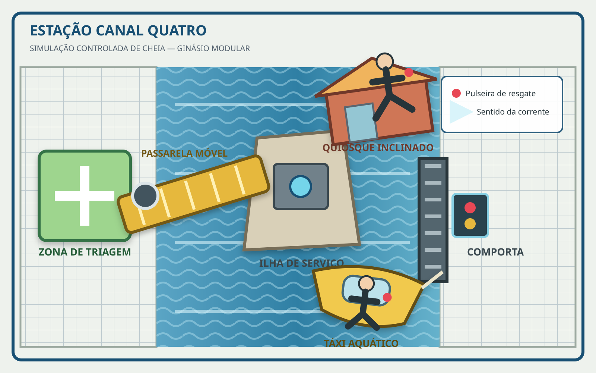
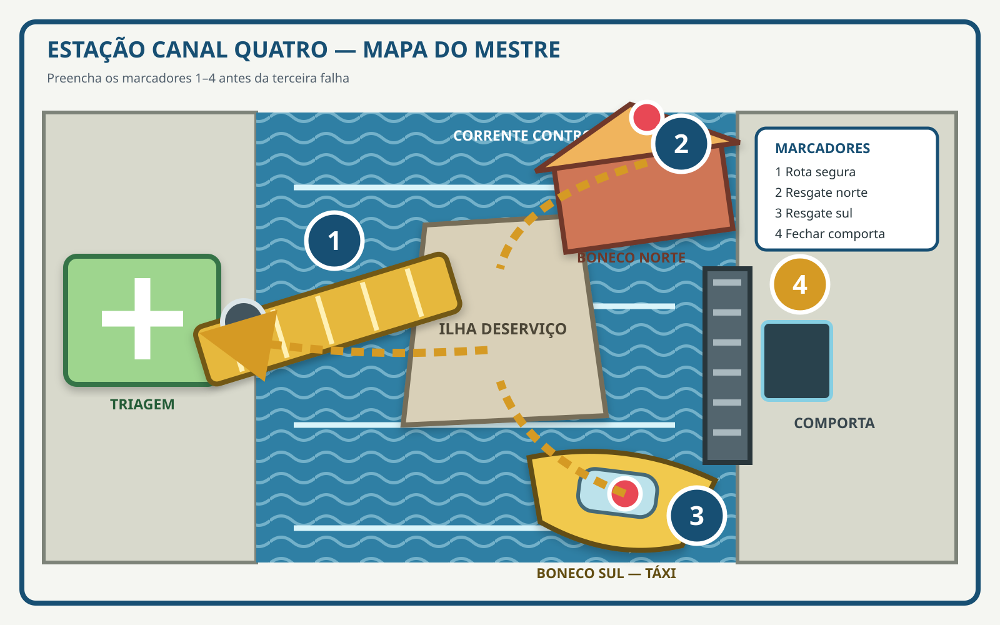

# Exame de Admissão

Os personagens chegam ao Instituto Atlas para um exame que ocupa um dia inteiro. Depois do credenciamento, enfrentam um circuito individual de controle, conhecem outros candidatos durante o intervalo e formam uma equipe para uma simulação de resgate no Ginásio Modular. O capítulo termina com a entrevista que transforma candidatos em alunos.

As provas medem Controle, Julgamento, Equipe, Responsabilidade e Prioridade. Todas as instalações funcionam sob supervisão, com rotas de saída e comando de pausa. Falhas produzem registros e oportunidades de desenvolvimento, enquanto as decisões dos personagens determinam como professores e colegas passam a reconhecê-los.

> **Leia em voz alta:** Hoje, os portões do Instituto Atlas estão abertos. Do outro lado ficam salas de aula, oficinas, alojamentos e o ginásio onde gerações de Extraordinários aprenderam a controlar aquilo que podiam fazer. Entre vocês e tudo isso existe um dia de provas. Não é preciso chegar como uma equipe. Ao fim do exame, porém, cada decisão mostrará que tipo de heróis vocês podem se tornar juntos.

## A história até aqui

Belamar convive com Extraordinários, equipes heroicas e a memória de crises que mudaram a cidade. O Instituto Atlas existe para formar jovens capazes de agir com responsabilidade antes de receber autorização para ocorrências reais. Seus alunos estudam, vivem no campus, treinam no Ginásio Modular e, mais tarde, atendem Chamados acompanhados pela Central de Operações.

Os personagens começam a campanha com 10 pontos, em escala Ningen. São candidatos: ainda não vivem no Atlas, não possuem licença do programa de campo e talvez nunca tenham trabalhado juntos. Cada um chegou até aqui por uma trajetória própria. O exame é o primeiro acontecimento que os coloca lado a lado.

O Atlas também recebe outros oito candidatos: Lia Vasconcelos, Ravi Moura, Cecília Dantas, Noah Sato, Malu Serrano, Ícaro Tavares, Sofia Mendonça e Dante Arcos. Professores e funcionários acompanham todas as etapas. As relações entre essas pessoas e os personagens começam durante esta aventura e serão definidas pelo que acontecer em jogo.

## Cena 1 — Os portões estão abertos

> **Leia em voz alta:** Além dos portões azuis, o Instituto Atlas parece uma escola construída dentro de uma sede heroica — ou talvez o contrário. Caminhos arborizados passam entre prédios de tijolos claros e estruturas de vidro. Drones de serviço carregam caixas para uma oficina, enquanto a água de um canal reflete as faixas do Exame de Admissão. Diante da mesa de credenciamento, jovens com uniformes, roupas comuns e equipamentos extraordinários tentam parecer menos nervosos do que realmente estão.

A entrada principal ocupa um terraço acima de um dos canais de Belamar. Os portões permanecem abertos, e faixas azuis conduzem a três pontos: credenciamento, guarda temporária de equipamento e acesso ao edifício central. Os personagens podem observar o campus, conversar entre si ou acompanhar alguém que tenha vindo se despedir. Depois de alguns minutos, a fila os leva até **Beatriz Leal**.

Beatriz usa vários cordões coloridos de identificação, calças cheias de bolsos e tênis silenciosos. Parece estar em três lugares ao mesmo tempo, mas recebe cada candidato pelo nome e repete uma informação sem demonstrar pressa. Ela entrega um identificador, confirma necessidades registradas e faz uma pergunta simples:

— O que o Atlas precisa saber para que você faça a prova com segurança?

A resposta informa adaptações concretas. Beatriz registra necessidades de acessibilidade, espaço, alimentação, privacidade e contenção de capacidades. Preparação relevante declarada aqui pode conceder **Ganho** quando entrar em jogo mais tarde.

Enquanto aguardam, os personagens veem os outros candidatos. Lia estuda o mapa do campus; Ravi confere a ordem dos documentos; Cecília abre espaço na fila; Noah observa o painel de horários; Malu pergunta se “entrada principal” significa que existe uma entrada mais interessante; Ícaro marca o ritmo do aviso sonoro com os dedos; Sofia chega cedo demais diante de uma porta ainda fechada; Dante acompanha o movimento das câmeras no teto.

Beatriz conduz todos a um auditório baixo, com janelas para o canal e um pequeno palco. **Álvaro Siqueira** aguarda no centro. Ele usa um casaco azul-escuro preso por um broche dourado em forma de sol. Os cabelos prateados e a postura ereta lhe dão presença antes que fale. Sua voz é baixa e deliberada; ele espera o salão silenciar.

Álvaro apresenta os cinco critérios do exame: **Controle, Julgamento, Equipe, Responsabilidade e Prioridade**. Todos possuem o mesmo peso. Potência máxima, velocidade ou vitória isolada só importam quando servem ao desafio proposto.

Ao lado dele, **Dalva Menezes** traz óculos de aros cor de cobre, mangas dobradas e um tablet coberto por etiquetas alinhadas. Ela fala com precisão e apresenta as cinco etapas do dia:

1. recepção e briefing;
2. circuito individual de controle;
3. intervalo orientado;
4. prova coletiva;
5. entrevista e resultado.

Dalva ensina o comando verbal **“Atlas, pausa”**. Usá-lo interrompe a estação atual e preserva a participação nas etapas seguintes. Uma faixa azul marca todas as rotas de saída. A Dra. Samira e uma equipe técnica acompanham o exame inteiro.

Peça a cada jogador que responda:

**O que seu personagem fez para se preparar para hoje, mesmo sem saber exatamente como seria a prova?**

Depois das respostas, Dalva chama os identificadores e abre as portas do Ginásio Modular.

## Cena 2 — O Circuito de Controle

> **Leia em voz alta:** O interior do ginásio se abre como um hangar. Passarelas técnicas cruzam o alto, e centenas de linhas luminosas dividem o chão em rotas precisas. Um módulo transparente desperta dentro de uma câmara branca; placas quadradas inclinam numa onda perfeitamente ordenada; no corredor final, drones suspensos acendem olhos azuis. Uma professora ergue dois dedos. Tudo para ao mesmo tempo. No silêncio que segue, Âncora diz: “Atlas, pausa. O sistema sempre vai ouvir vocês.”

O Ginásio Modular possui painéis móveis, trilhos no piso e cabines envidraçadas de controle. As três estações ficam em faixas paralelas, todas com saídas visíveis. Os professores demonstram o funcionamento e o desligamento antes da primeira tentativa.

**Lívia Monteiro, Métrica** supervisiona a Câmara de Calibração. Ela veste um jaleco cinza cujas costuras formam linhas geométricas azuladas. O cabelo escuro termina num corte reto junto ao queixo; mãos e olhar se movem com a mesma economia. Suas perguntas são curtas: “Você consegue fazer de novo?” e “Como sabe onde está seu limite?”.

**Caio Ventura, Impacto** acompanha o Piso de Vetores. Usa jaqueta esportiva laranja e mantém os pés afastados como se o chão pudesse mudar a qualquer momento. Seu sorriso é aberto; sua voz cresce apenas para atravessar o barulho das plataformas.

**Janaína Rocha, Âncora** coordena o Corredor Sentinela. Usa uniforme azul profundo, botas de sola larga e uma trança sobre um dos ombros. Fala num tom firme que permanece audível entre sirenes e motores.

**Raul Farias, Vestígio** circula pelas três faixas com um sobretudo verde-acinzentado e uma prancheta transparente. Quase nunca levanta a voz; prefere indicar uma marca no chão e deixar que o candidato perceba por que ela importa.

Cada personagem enfrenta as estações abaixo, nesta ordem.

### Câmara de Calibração

A Câmara mede uma coisa: **o candidato consegue produzir um resultado deliberado, repeti-lo e parar no momento combinado?**

No centro do cilindro existe um módulo de treino transparente. Métrica pergunta ao jogador:

— Qual uso seguro da sua capacidade você quer demonstrar?

O jogador descreve um resultado curto e observável. Métrica configura o módulo para responder a esse uso. A prova acontece em três comandos fixos:

1. **Executar:** o personagem produz o resultado uma vez, mantendo o efeito dentro da faixa azul indicada pelos sensores.
2. **Repetir:** depois que o módulo volta ao estado inicial, o personagem tenta produzir o mesmo resultado.
3. **Parar:** durante a repetição, um sinal sonoro toca e o personagem encerra imediatamente a ação.

Resolva os três comandos com **um único teste de perícia, meta 9**. O teste representa consistência durante a sequência inteira. Use a perícia ligada ao método do personagem: Máquinas para equipamento, Mística para manifestação sobrenatural, Esporte para movimento ou força corporal, Saber para técnica estudada, ou outra perícia quando a descrição tornar sua aplicação clara.

Exemplos prontos:

- **força:** pressionar uma placa até a faixa azul, repetir a mesma pressão e soltar no sinal;
- **velocidade ou teleporte:** alcançar uma marca, repetir o percurso e imobilizar-se dentro da zona de parada;
- **energia ou ataque à distância:** iluminar somente o núcleo do módulo, repetir o padrão e cortar a emissão no sinal;
- **transformação:** assumir uma característica declarada, repeti-la e revertê-la no sinal;
- **percepção:** localizar um sinal entre interferências, confirmar o mesmo padrão e interromper a busca no sinal;
- **proteção, cura ou suporte:** estabilizar um simulador até a faixa azul, repetir o procedimento e encerrá-lo no sinal;
- **dispositivo ou criatura auxiliar:** emitir o comando, obter a mesma resposta e recolher ou desligar o recurso no sinal.

Se a capacidade não se encaixar nos exemplos, mantenha os três verbos — executar, repetir e parar — e adapte apenas a resposta visual do módulo.

- **Sucesso:** as duas execuções ficam dentro da faixa azul e cessam no sinal. O personagem recebe **Ganho** em seu primeiro teste do Piso de Vetores.
- **Falha:** a segunda execução difere da primeira ou demora a cessar. As barreiras contêm o efeito, Métrica registra Controle em formação e o personagem segue para a próxima estação.
- **Falha crítica:** o efeito ultrapassa a faixa azul. Métrica aciona a pausa, o módulo absorve a manifestação e ela pede que o personagem identifique o primeiro sinal de perda de controle. A resposta encerra a estação com segurança.

Caso alguém declare que sua capacidade exige privacidade ou contenção específica, Métrica conduz o candidato a uma sala adjacente com um módulo equivalente. A sequência e os resultados permanecem os mesmos, e o personagem retorna antes do Piso de Vetores.

### Piso de Vetores

A faixa forma um tabuleiro de placas móveis. Setas luminosas anunciam deslocamentos laterais e mudanças de inclinação antes de cada ciclo. Faça um teste **meta 9**. Esporte acompanha o movimento; Percepção lê o padrão; Máquinas antecipa o ciclo; capacidades de mobilidade ou proteção podem atravessar a faixa diretamente quando a descrição resolve o obstáculo.

- **Sucesso:** o personagem cruza e pode usar **Ajuda** para orientar o candidato seguinte.
- **Falha:** o piso conduz o personagem a uma baia acolchoada. Ele retorna por uma passagem lateral e começa o Corredor Sentinela com **Perda**.
- **Falha crítica:** além da Perda, Impacto pede que o candidato identifique qual aviso ignorou. A resposta permite prosseguir.

O movimento sempre possui aviso. Caminhar devagar, estudar o ciclo e criar uma rota segura são soluções tão válidas quanto reagir depressa.

### Corredor Sentinela

Três drones lançam feixes de marcação inofensivos enquanto painéis móveis criam cobertura. O objetivo é alcançar o terminal com no máximo uma marca. Faça um teste **meta 12**. Esporte permite avançar entre coberturas; Percepção identifica janelas; Máquinas prevê trajetórias; Manha engana sensores; capacidades defensivas, ilusórias ou de mobilidade também funcionam.

- **Sucesso:** o personagem alcança o terminal com zero ou uma marca.
- **Falha:** recebe marcas adicionais e conclui a faixa por uma rota protegida indicada no chão.
- **Falha crítica:** um drone projeta “rota encerrada”; Âncora desativa o aparelho e pede outra abordagem que o personagem poderia tentar.

Neutralizar os drones de forma segura cumpre o desafio. Destruir equipamento funcional encerra a faixa e registra Responsabilidade em formação.

### Os outros candidatos no circuito

Entre os testes dos personagens, mostre os outros candidatos em ações rápidas:

- **Lia Vasconcelos, Atalho**, tem cachos escuros presos no alto, jaqueta amarela curta e tênis da mesma cor. Seus olhos percorrem portas, passarelas e espaços vazios antes da largada. Ela encontra uma rota curta no Piso e cruza com um sorriso de quem acabou de confirmar uma suspeita.
- **Ravi Moura, Trama**, usa cardigã bordô, pulseiras de fios coloridos e uma bolsa dividida em compartimentos. Enquanto espera, desenha conexões no ar com o indicador. Ele oferece Ajuda a Cecília, descrevendo em voz alta o ritmo das placas.
- **Cecília Dantas, Prumo**, traz uma trança longa, colete ameixa e um pequeno nível de bolha preso como chaveiro. Mantém os ombros alinhados mesmo quando o piso se move. Ela segue as indicações de Ravi, ajusta o próprio ritmo e termina sem pressa e sem marcas.
- **Noah Sato, Gambito**, usa colete preto com um broche quadriculado e mantém uma mecha clara caída sobre a testa. Ele atravessa deliberadamente o primeiro feixe, aceitando uma marca permitida pela prova, para observar o intervalo entre os outros dois drones; ao sair, aponta o padrão aos candidatos seguintes com um meio sorriso satisfeito.
- **Malu Serrano, Rasura**, tem cabelo curto com uma faixa azul, dedos manchados de marcador e um bloco cheio de palavras riscadas. Antes de entrar, ergue uma sobrancelha e pergunta se a instrução exige passar entre as divisórias. Com a permissão recebida, atravessa por cima de uma delas.
- **Ícaro Tavares, Refrão**, carrega fones grandes ao redor do pescoço e marca compassos na lateral da perna. Ele transforma os sinais do circuito numa contagem curta e sincroniza cada passo com o aviso sonoro.
- **Sofia Mendonça, Pulso**, usa jaqueta vermelha, cabelo preso por uma faixa branca e um bracelete esportivo. Inclina o corpo para a frente antes mesmo da autorização. Ela começa rápido demais, percebe a mudança das placas, recua até a área segura e tenta novamente depois de respirar.
- **Dante Arcos, Órbita**, usa óculos redondos e jaqueta preta com um pequeno remendo planetário. Mantém as mãos nos bolsos enquanto acompanha as trajetórias. Ele espera uma órbita completa dos drones, retira uma mão apenas para marcar o intervalo e então avança.

Ao fim do circuito, cada professor registra um ponto forte e um aspecto em formação. A Dra. Samira Nasser conduz o grupo ao intervalo.

### Interrupção de protocolo

Se alguém tenta ferir outro candidato, desativa deliberadamente uma segurança ou continua depois de “Atlas, pausa”, Dalva interrompe a faixa. Samira verifica os envolvidos, e o personagem explica o que pretendia. A etapa conta como falha e Responsabilidade fica em formação. A sequência retorna na estação seguinte, ou segue para o intervalo quando o circuito já terminou.

## Cena 3 — Nomes no mesmo painel

> **Leia em voz alta:** O refeitório troca o eco metálico do ginásio por cheiro de pão quente, fruta cortada e madeira encerada. Pelas janelas, embarcações pequenas passam no canal. Alguns candidatos comemoram como se já tivessem entrado; outros estudam os próprios resultados refletidos nas telas apagadas. Quando o painel central desperta, nomes e equipes surgem em letras brancas. Pela primeira vez desde o início do exame, os nomes de vocês aparecem lado a lado.

O refeitório possui mesas compridas, nichos menores junto às paredes e janelas voltadas para a água. Uma bancada oferece lanche e opções identificadas para diferentes necessidades alimentares. Perto de uma área silenciosa com poltronas, **Dra. Samira Nasser** usa um casaco médico vinho sobre roupas confortáveis e leva uma bolsa compacta presa à cintura. Seu olhar procura respiração curta, mãos tensas e sinais de exaustão. Ela verifica os candidatos e confirma a recuperação dos recursos usados no circuito antes da prova coletiva.

Beatriz atualiza o painel: os personagens formam uma equipe. Os oito estudantes recorrentes são distribuídos em duas equipes paralelas. Faça uma rodada de conversa. Cada jogador escolhe quem abordar ou responde ao primeiro estudante ainda disponível.

**Lia** chega primeiro, mas não se senta até localizar as duas saídas e a fila do lanche. Ela aponta o Piso de Vetores com o polegar e pergunta: “Qual parte pareceu mais injusta?”. Escuta a resposta inteira; se alguém apresenta uma leitura que não percebeu, seu sorriso competitivo dá lugar a interesse genuíno. Lia gosta de atalhos, mas gosta ainda mais de descobrir que existe outro.

**Ravi** abre espaço na mesa e organiza copos e guardanapos como se já estivesse distribuindo funções. Ele compara formas de oferecer Ajuda, chama os personagens pelo nome assim que os aprende e tende a preencher qualquer silêncio: “Eu avisei o ritmo para a Cecília, mas talvez tenha falado demais. Vocês preferem chamada curta ou explicação completa?”. Quando alguém pede tempo, ele se corrige e espera.

**Cecília** escolhe uma cadeira de onde possa ver o painel sem bloquear a passagem. Sua presença desacelera a conversa ao redor. Ela oferece água antes de fazer perguntas e diz: “Não precisa responder agora” sempre que percebe hesitação. Caso alguém esteja frustrado com uma falha, Cecília trata o erro como informação prática, não como motivo para consolo exagerado.

**Noah** acompanha a atualização das equipes enquanto gira o broche quadriculado entre os dedos. Ele comenta: “O painel mostra resultado. Os professores estavam olhando escolhas”. Se alguém pergunta pela marca que aceitou, Noah explica que uma marca ainda permitia concluir a faixa e que observar o ciclo ajudaria quem viesse depois. Ele pensa em trocas e consequências, mas admite quando um plano depende de informação que ainda não possui.

**Malu** apoia o bloco aberto sobre a mesa. Quase todas as anotações têm uma palavra riscada e outra escrita por cima. Ela pergunta: “Qual regra vocês interpretariam de outro jeito?”. Seu desafio não vem acompanhado de deboche; Malu testa pressupostos para descobrir espaço de ação. Quando alguém oferece uma resposta melhor, ela risca a própria ideia e anota a nova.

**Ícaro** tamborila a cadência dos drones no tampo até perceber que Ravi começou a acompanhar sem querer. Ele ri, reduz o volume e transforma o padrão numa chamada de equipe: duas batidas para preparar, uma para agir. Ícaro procura ritmo comum quando as pessoas falam ao mesmo tempo e usa humor para aliviar tensão, não para diminuir o erro de alguém.

**Sofia** permanece sentada na ponta da cadeira, como se o intervalo também tivesse uma linha de largada. Ela admite antes de qualquer pergunta: “Eu fui cedo demais. Pelo menos percebi antes da baia”. Pergunta quem também precisou recomeçar e reage bem a respostas honestas. Sua competitividade aparece como vontade de tentar outra vez, e não como necessidade de ver alguém perder.

**Dante** observa a comporta da prova seguinte por uma das janelas internas do ginásio. Quando se aproxima, pergunta: “Alguém viu se ela fecha com um console ou dois?”. Ele fala pouco, deixa alguns segundos antes de responder e aponta trajetórias com movimentos discretos do indicador. Uma pergunta sobre seu silêncio recebe uma resposta simples: “Estou acompanhando o que se move”.

Depois de uma interação por personagem, Dalva chama as equipes. Reconhecimento, simpatia, incômodo ou curiosidade seguem exatamente o tom da conversa; a aventura ainda não fixa amizade ou rivalidade.

## Cena 4 — Estação Canal Quatro

> **Leia em voz alta:** O chão do ginásio desapareceu sob uma pequena rua de Belamar atingida por uma cheia. Água escura corre entre fachadas sem teto. Uma passarela amarela gira lentamente sem alcançar a ilha de serviço no centro do canal. Ao norte, um boneco de resgate está caído sobre a cobertura inclinada de um quiosque; ao sul, outro balança dentro de um táxi aquático preso junto à comporta. As pulseiras dos dois piscam em vermelho. Na margem onde vocês estão, um retângulo verde indica a zona de triagem. A voz de Âncora chega limpa pelos alto-falantes: “A água vai subir em três minutos simulados. Retirem as duas vítimas e fechem a comporta.”

A Estação Canal Quatro simula uma cheia repentina numa rua baixa de Belamar. O cenário é controlado: a água alcança a cintura de uma pessoa comum, jatos laterais produzem corrente sem força para ferir e redes acolchoadas cercam os pontos de queda. Dentro da ficção do exercício, porém, a corrente está aumentando e duas pessoas precisam ser retiradas antes que a comporta isole a parte sul do canal.

### Mapa da estação

*Mapa para apresentar aos jogadores quando Âncora concluir o briefing.*

*Mapa do Mestre: os números correspondem aos quatro marcadores de progresso.*

A **zona de triagem** fica na margem inicial, em terreno elevado. A **passarela amarela** está destravada e gira lentamente sobre um pivô; primeiro precisa ser alinhada com a ilha de serviço ou substituída por outra rota criada pelos personagens.

O **boneco norte** possui o peso e as articulações de uma pessoa adulta. Está sobre a cobertura molhada e inclinada de um quiosque. Uma faixa laranja de transporte fica presa ao seu colete. Alcançá-lo exige atravessar a ilha, subir pela estrutura e impedir que o boneco deslize durante a retirada.

O **boneco sul** possui o mesmo peso e está dentro de um táxi aquático preso por um único cabo. A corrente faz a embarcação bater de leve contra defensas acolchoadas. Para retirá-lo, alguém precisa estabilizar o táxi, entrar ou alcançar seu interior e manter posição enquanto o boneco é transportado.

As faixas laranjas funcionam como cintos e pontos de pega; elas não movem os bonecos automaticamente. As pulseiras permanecem vermelhas enquanto os bonecos estão no canal e ficam verdes quando seus corpos atravessam por completo a linha da **zona de triagem**.

A **comporta** fica depois do táxi. Seu fechamento encerra a corrente, mas também sela a reentrância onde está a embarcação. O console libera a sequência final quando as duas pulseiras ficam verdes. Assim, primeiro a equipe transporta fisicamente os dois resgatados até a triagem; depois fecha a comporta.

Âncora aponta cada elemento, demonstra as pulseiras e repete o comando de pausa. Atrás de um vidro lateral, Raul registra a leitura do cenário. Ao lado dele está **Tomás Valença**, de camisa cinza, suéter escuro e relógio analógico gasto. Nada em sua aparência compete com os uniformes heroicos ao redor. Ele inclina ligeiramente a cabeça antes de perguntar:

— Como vocês vão avisar que precisam de Ajuda?

Dê dois minutos reais para os jogadores combinarem comunicação. Em seguida, inicie uma **meta estendida em grupo**: a equipe precisa preencher quatro marcadores de progresso antes de acumular três falhas.

### Objetivo da prova

A equipe deve transportar fisicamente os dois bonecos até a zona verde e fechar a comporta. Cada resgate inclui alcançar o boneco, tirá-lo da posição de perigo e fazer seu corpo atravessar por completo a linha da triagem.

Os personagens podem, entre outras abordagens coerentes:

- carregar ou arrastar os bonecos pelas faixas laranjas;
- usar força ampliada para levar um ou ambos;
- voar ou usar supervelocidade para fazer viagens de retirada;
- mover os bonecos por telecinese, controle gravitacional ou capacidade semelhante;
- abrir um portal entre a vítima e a triagem;
- criar ponte, plataforma, campo de força, gelo ou outro caminho estável;
- controlar a água ou a embarcação para facilitar o acesso;
- operar a passarela e a comporta pelos consoles;
- usar **Ajuda** para estabilizar, proteger ou transportar em conjunto.

Uma capacidade resolve aquilo que sua descrição realmente permite. Mesmo quando o método muda, o resultado exigido permanece visível: os dois bonecos na triagem e a comporta fechada.

### Os quatro marcadores de progresso

1. **Rota segura:** alinhar e travar a passarela entre a triagem e a ilha de serviço, ou criar outro caminho estável que a equipe possa usar durante os resgates.
2. **Resgate norte:** alcançar a cobertura inclinada, retirar o boneco e levá-lo por completo até a zona de triagem.
3. **Resgate sul:** estabilizar o táxi, retirar o segundo boneco e levá-lo por completo até a zona de triagem.
4. **Comporta fechada:** acionar o console e encerrar a corrente depois que as duas pulseiras estiverem verdes.

Coloque quatro marcas visíveis sobre a mesa. Retire uma quando a tarefa correspondente for concluída. Rota segura, Resgate norte e Resgate sul podem ser tentados em qualquer ordem. O marcador Comporta fechada só fica disponível depois dos dois resgates.

Enquanto a Rota segura estiver incompleta, testes dos dois resgates têm **Perda**, porque o personagem precisa enfrentar a corrente ou a passarela móvel durante todo o transporte. Uma capacidade que forneça acesso estável ao personagem cancela essa Perda; para preencher também o marcador Rota segura, a solução precisa criar um caminho que continue disponível para a equipe.

Os três minutos anunciados fazem parte da ficção da simulação. Na mesa, o tempo é representado pela disputa entre preencher os quatro marcadores e acumular três falhas; não é necessário contar rodadas ou minutos reais.

### Como funciona uma rodada

1. Escolha um jogador cujo personagem ainda não agiu nesta rodada. Todos agem uma vez antes que alguém volte a agir.
2. O jogador escolhe um marcador ainda incompleto e descreve como seu personagem tenta avançá-lo.
3. Use o teste padrão indicado abaixo. Uma capacidade que muda claramente a abordagem pode justificar outro atributo ou perícia conforme as regras básicas.
4. O jogador rola os dados, soma o atributo e compara o total com **meta 9**.
5. Resolva o resultado antes de passar ao próximo personagem.

| Marcador | Teste padrão | Exemplos de ação |
|---|---|---|
| **Rota segura** | Habilidade; Esporte ou Máquinas | cruzar o trecho móvel, operar o console e travar a passarela; uma ponte, voo compartilhado ou portal estável também pode criar a rota |
| **Resgate norte** | Poder; Luta ou Esporte | subir na cobertura, segurar o peso humano e carregá-lo, arrastá-lo ou movê-lo até a triagem |
| **Resgate sul** | Poder; Luta ou Esporte | estabilizar o táxi, retirar o peso humano e transportá-lo contra a corrente até a triagem |
| **Comporta fechada** | Habilidade; Máquinas ou Percepção | confirmar as duas pulseiras verdes, executar a sequência no console e encerrar a corrente |

Ter a perícia indicada acrescenta o dado correspondente conforme a regra básica. Preparação aplicável, posição favorável ou ação anterior pode conceder **Ganho**. As complicações abaixo podem impor **Perda**. Outro personagem pode gastar sua ação usando **Ajuda**; nesse caso ele concede o benefício normal ao teste seguinte, mas não rola nem preenche um marcador naquele turno. **Pontos de Ação** podem melhorar os testes normalmente.

### Obtendo sucesso

Se o total do teste for **9 ou mais**, a ação tem sucesso. Retire a marca da tarefa escolhida e descreva a mudança concreta: a passarela se encaixa na ilha, o boneco norte atravessa a linha verde, o boneco sul chega à triagem ou a comporta desce e a corrente para.

Se o resultado alcançar o dobro da meta, aplique a regra de meta estendida. O personagem preenche o marcador escolhido e mais um marcador cujos requisitos já estejam cumpridos. Caso nenhum outro marcador esteja disponível, o próximo teste da equipe recebe Ganho.

### Obtendo uma falha

Se o total for **menor que 9**, a ação falha. O marcador permanece sobre a mesa. Conforme a tarefa, a passarela passa pelo ponto de encaixe, o personagem precisa apoiar o boneco norte antes de continuar, o táxi gira e obriga a equipe a reposicionar o peso, ou o console recusa a sequência antes de completar o fechamento. Marque uma falha para a equipe e aplique a próxima complicação da lista.

Uma falha crítica conta como **duas falhas**, conforme a regra de meta estendida. Aplique duas complicações em sequência, respeitando o limite de três falhas.

1. **Primeira falha — pulso de corrente:** os jatos laterais aumentam por um ciclo. O próximo teste da equipe tem Perda; depois desse teste, a água retorna ao fluxo anterior.
2. **Segunda falha — rota curta bloqueada:** um drone estende uma barreira de espuma entre as plataformas. O próximo teste tem meta 12, pois a ação também precisa abrir, contornar ou atravessar a barreira. Depois desse teste, a meta volta a 9.
3. **Terceira falha — fim do tempo:** o painel fica azul, Âncora congela o cenário e a prova segue para **Recomposição assistida**.

### Encerrando a prova

A equipe vence o desafio quando preenche os quatro marcadores. O painel fica verde, a água desacelera e Âncora encerra a simulação. Se a terceira falha ocorrer primeiro, o painel fica azul e começa a recomposição descrita abaixo.

Durante o desafio, as equipes paralelas permanecem em módulos separados; ruídos da contagem de Ícaro ou da coordenação de Ravi podem atravessar as divisórias, mas nenhum NPC entra no módulo dos personagens.

### Recomposição assistida

Se a equipe acumula três falhas, Âncora abre uma rota segura. Os personagens entram juntos e escolhem uma ação final sem teste: levar até a triagem um dos bonecos ainda no canal ou estabilizar a rota para a equipe técnica. Depois que ambos estão na zona verde, a equipe técnica fecha a comporta diante deles. A escolha registra Prioridade demonstrada e leva o grupo à entrevista com uma consequência clara para discutir.

## Cena 5 — O Caderno de Campo

> **Leia em voz alta:** A última sala do exame é menor que qualquer uma das anteriores. Não há drones, cronômetro ou linha de largada — apenas uma mesa redonda, cadeiras e a luz alaranjada do fim da tarde atravessando a janela. No painel da parede, cinco palavras permanecem acesas: Controle. Julgamento. Equipe. Responsabilidade. Prioridade. Tomás apoia um caderno de capa azul no centro da mesa. “Agora”, ele diz, “queremos saber o que vocês viram quando estavam lá dentro.”

A sala possui água, cadeiras suficientes para toda a equipe e uma janela para o campus. Álvaro senta de frente para a porta. Dalva mantém o tablet fechado enquanto os personagens respondem. Tomás conduz a conversa sem testes sociais, fazendo três perguntas:

1. Em que momento vocês trabalharam como equipe?
2. Qual decisão teve uma consequência inesperada?
3. O que cada um precisa aprender no Atlas?

Use fatos ocorridos durante as cenas. Sucesso repetido na Câmara sustenta Controle demonstrado; recuperação depois de uma falha sustenta Responsabilidade; Ajuda efetiva sustenta Equipe; leitura de padrões sustenta Julgamento; uso consciente da pausa ou escolha na recomposição sustenta Prioridade.

Álvaro comunica um dos resultados:

- **ingresso regular:** para candidatos que demonstraram condições de seguir a formação comum;
- **ingresso com plano de desenvolvimento:** para quem possui uma dimensão em formação. O plano nasce do fato ocorrido e pode ser treino supervisionado, exercício de comunicação, reparação com candidato afetado ou revisão de segurança.

Resultados individuais podem ser diferentes, e todos permanecem juntos como alunos. Dalva explica o primeiro horário. Tomás entrega a primeira página do Caderno de Campo. Ao saírem, mostre um estudante recorrente reconhecendo a equipe com aceno, comentário ou silêncio conforme a conversa do intervalo.

## Fichas dos desafios

| Desafio | Ativação | Meta | Sucesso | Falha |
|---|---|---:|---|---|
| **Câmara de Calibração** | declarar um resultado observável | 9 | executar, repetir e parar; Ganho no Piso | repetição varia ou demora a cessar; Controle em formação |
| **Piso de Vetores** | entrar na primeira placa | 9 | travessia e possibilidade de Ajuda | baia acolchoada; Perda no Corredor |
| **Corredor Sentinela** | cruzar a linha amarela | 12 | terminal com até uma marca | rota protegida e registro do resultado |
| **Estação Canal Quatro** | iniciar a prova coletiva | rota segura, dois bonecos na triagem e comporta fechada antes de três falhas; testes 9 | resultado ≥9 preenche o marcador escolhido | resultado <9 mantém o marcador e ativa a próxima complicação |

As estações usam barreiras, marcação luminosa, plataformas controladas e rotas de saída. Professores encerram qualquer faixa acionada pelo comando “Atlas, pausa”.

## Experiência

### Objetivo Maior — concluir a Estação Canal Quatro

Obter quatro sucessos antes de três falhas na prova coletiva concede **5 XP**.

### Objetivos Menores

Cada objetivo cumprido concede **1 XP**:

- cada personagem conclui a Câmara de Calibração respeitando o limite declarado;
- pelo menos um personagem usa Ajuda para favorecer outra pessoa;
- o grupo estabiliza a passarela antes de retirar o segundo boneco;
- os personagens identificam no debriefing uma decisão que mudariam;
- a equipe conclui o exame preservando equipamentos e protocolos de segurança.

Bônus por criatividade, códigos e proteção seguem as regras básicas de **3DeT Victory**.

## Encerrando a aventura

Confirme o ingresso de cada personagem e registre uma dimensão demonstrada ou em formação no Caderno de Campo. Para planos de desenvolvimento, anote a ação concreta derivada do exame e leve-a a uma cena futura no campus.

Escolha como consequência da equipe o fato produzido pela Estação Canal Quatro:

- painel verde: Âncora registra a primeira operação simulada concluída;
- recomposição assistida: a pendência escolhida se torna tema do primeiro treino coletivo;
- Ajuda decisiva: um estudante comenta a coordenação no próximo encontro;
- solução criativa e segura: Métrica solicita uma demonstração numa aula futura.

Finalize descrevendo os personagens atravessando o campus ao entardecer com seus identificadores de alunos. A próxima aventura começa no Instituto Atlas e recupera ao menos uma consequência individual, uma interação com estudante e o registro coletivo do exame.
