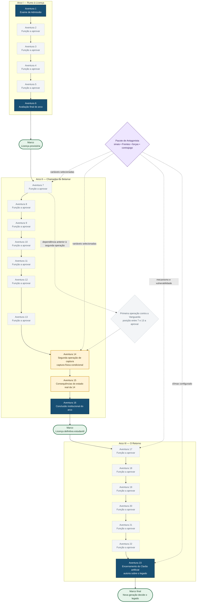

# Mapa editorial da saga

> **Planejamento interno:** este grafo não integra o livro e não estabelece cânone por si só. As arestas mostram sucessão editorial, Marcos ou dependências; não impõem uma sequência de cenas nem um único resultado válido.

Documentos relacionados: [Arco I](../../campanha/arcos/arco-1/README.md), [Arco II](../../campanha/arcos/arco-2/README.md) e [Arco III](../../campanha/arcos/arco-3/README.md).

## Legenda

- **Fato fixo:** função já aprovada pela campanha.
- **Consequência condicional:** recebe o estado realmente produzido pelos jogadores.
- **Variável do Pacote:** depende do antagonista escolhido e não possui resposta padrão.
- **Lacuna editorial:** posição existente cuja função individual ainda precisa de aprovação.

## Estado de atualização

O Exame de Admissão é o primeiro piloto. Uma posição só deixa a classe de lacuna quando sua função recebe aprovação explícita. Escolher um Pacote não transforma resultados condicionais em resultados obrigatórios.
